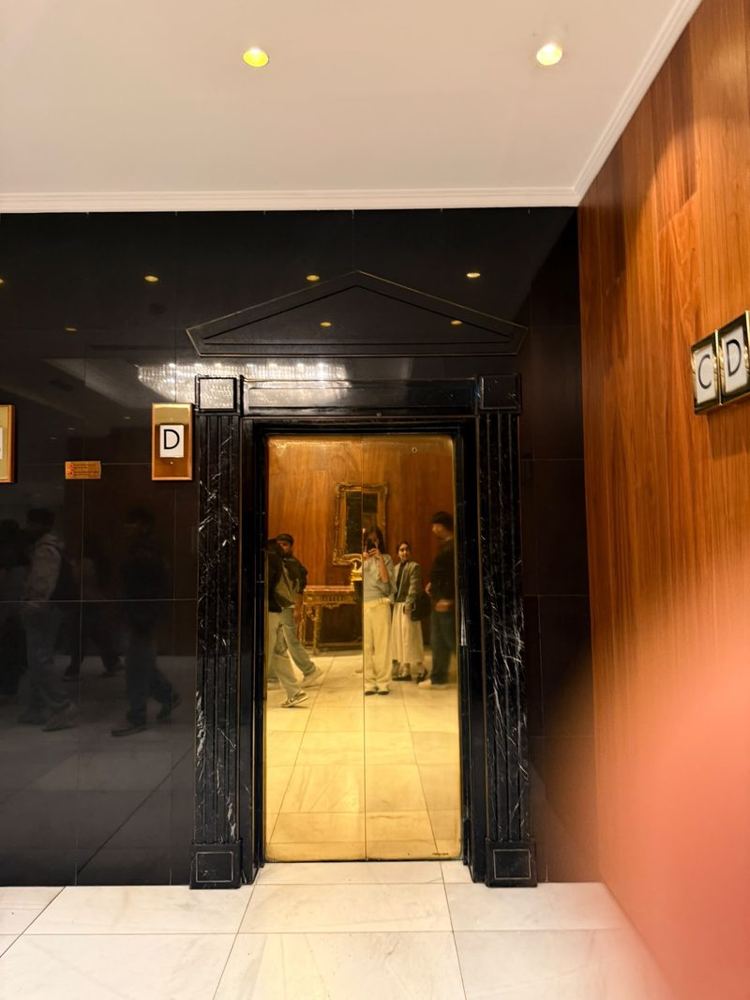
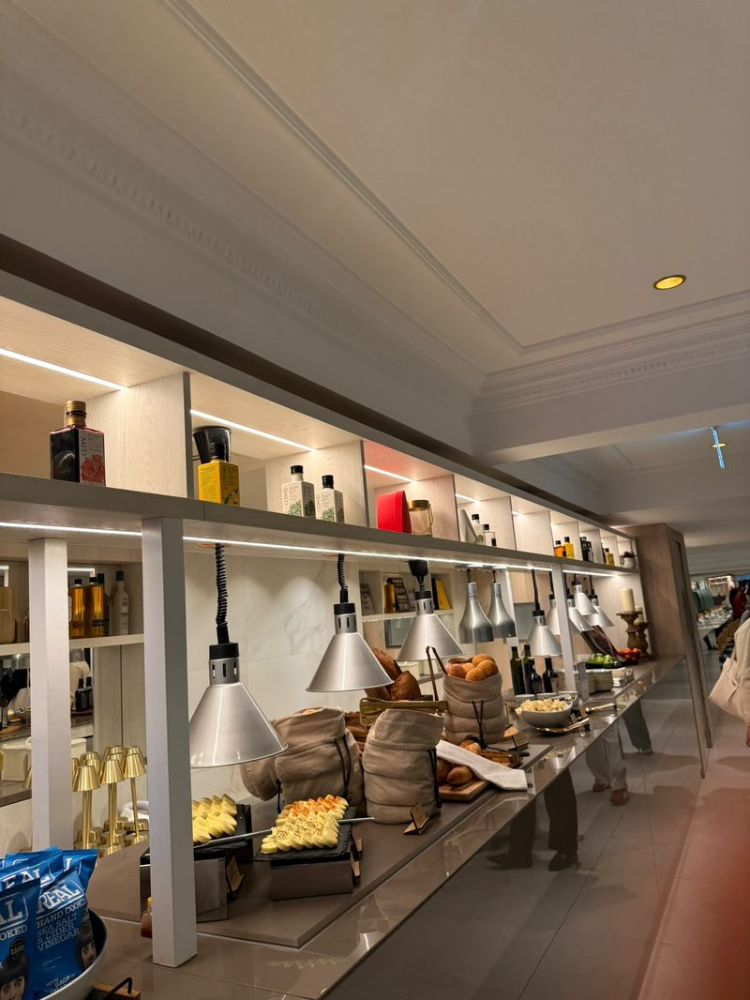
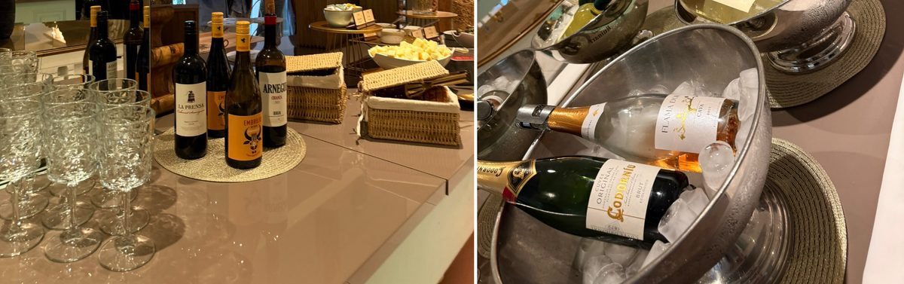
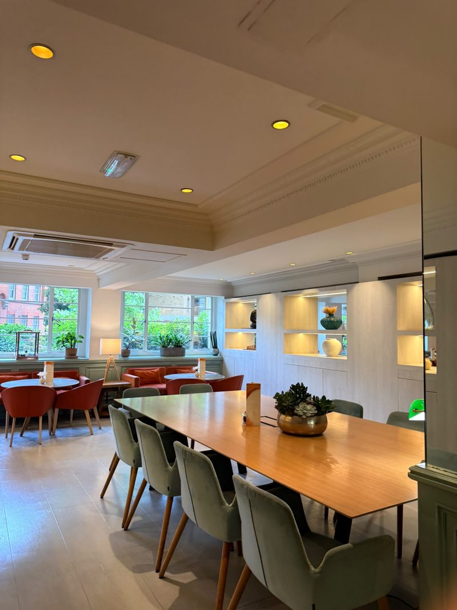
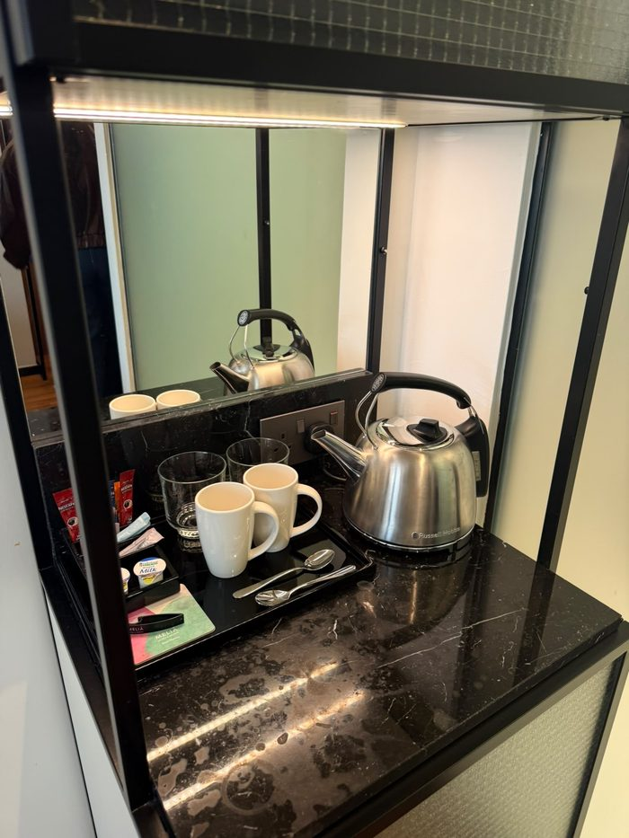
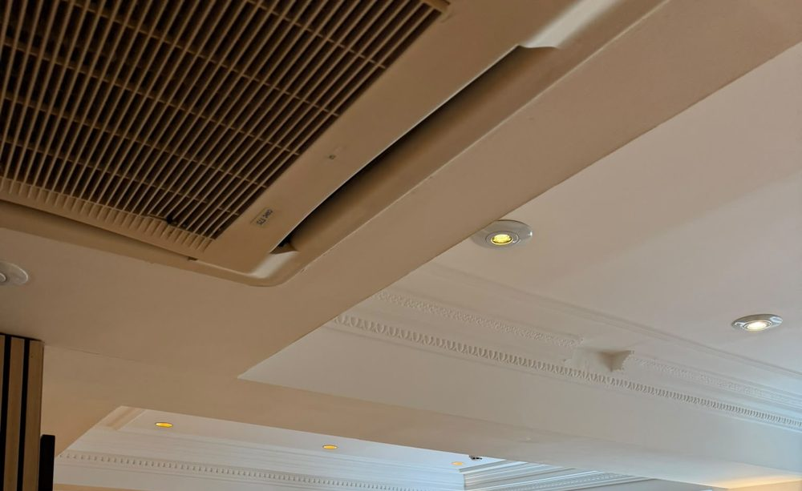
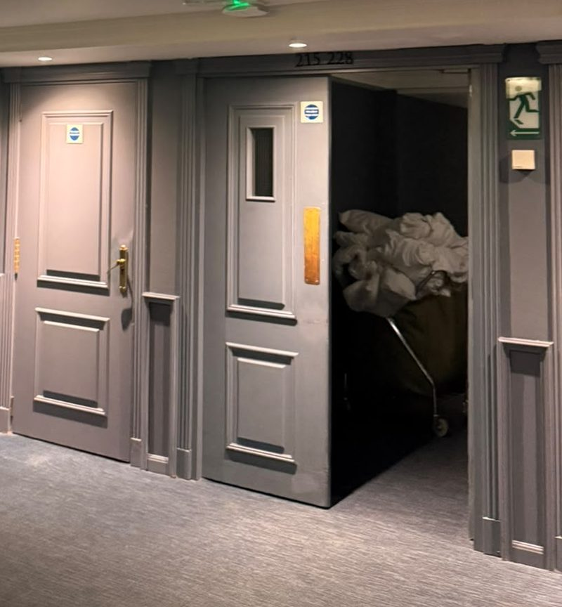
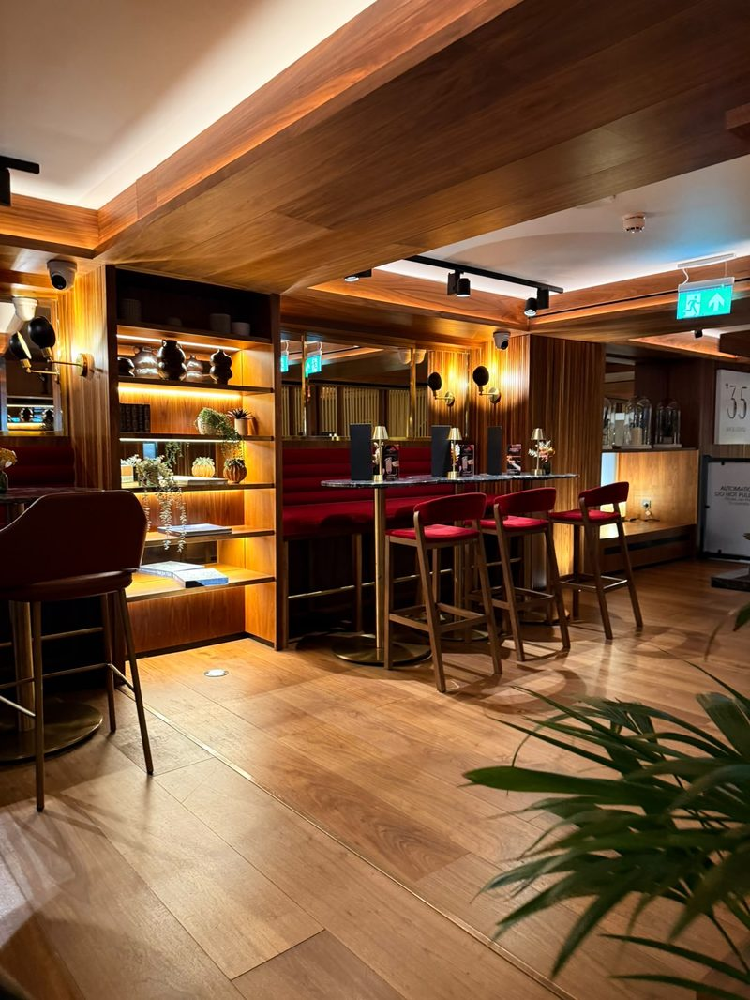
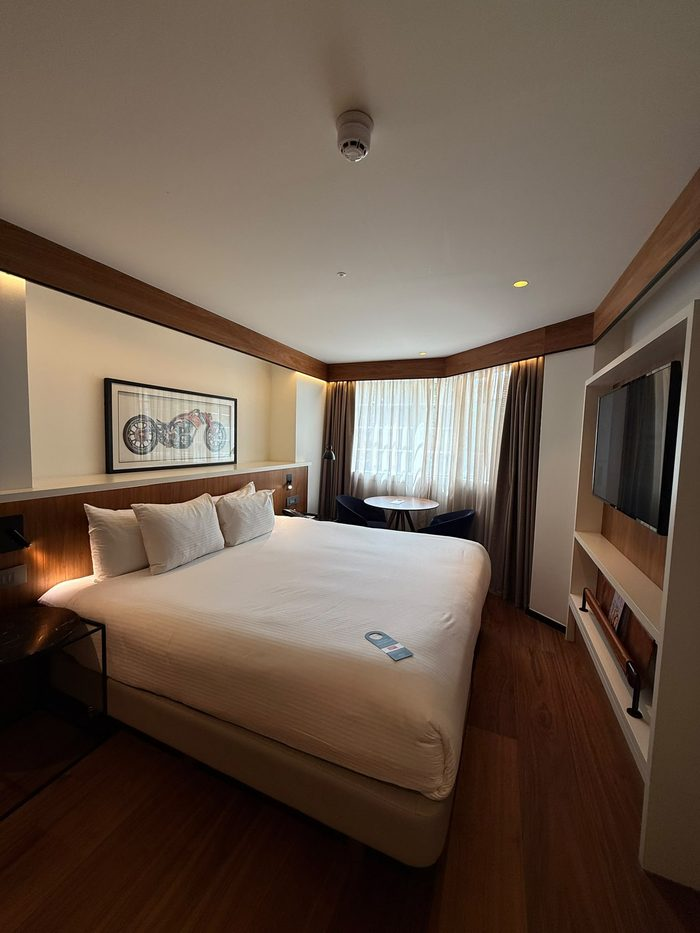

**Draft status.** One item still needs your own data: the coded review sample in Appendix 4 and the three sentences in Chapter 5 that depend on it, marked [SQUARE BRACKETS]. Everything else is written from your photographs and from sources I checked by search. Other brackets mark facts to confirm against the original page. Delete this note and all brackets before you submit.

# 1. Introduction

Meliá White House is a Grade II listed building on Albany Street, London, designed in 1936 and operated by Meliá since 1999 (Historic England, n.d.). Meliá reports a £40m, five-year renovation of its 581 bedrooms and suites, restaurant, bar and public spaces, carried out while the hotel kept trading (Hospitality Net, 2023). Business Traveller (2024) dates completion to April 2023. The hotel now sells itself as premium.

The question is whether the hotel keeps that promise at every point a guest touches and, where it does not, what is the cheapest way to close the gap. The aim is to assess how consistently the post-renovation strategy reaches the guest, using food and beverage (F&B) as the main lens, and to recommend practical, costed fixes. Four objectives follow:

1. Which lenses from the literature suit the problem? (Chapter 3)
2. Were four management decisions good enterprise choices? (Chapter 4)
3. How well do those decisions work, judged by visit evidence, documents and reviews? (Chapter 5)
4. What four fixes are costed, timed and measurable? (Chapter 6)

The argument is that the hotel delivers its premium promise where guests look first (public spaces, breakfast, bar) and under-delivers where they look closely (condition and consistency). That gap matters more at a quoted rate near £300 than at about £117 [VERIFY BOTH PRICES]. Chapter 2 sets out the method, Chapters 3 and 4 the tools and the decisions, Chapter 5 the evidence, and Chapters 6 and 7 the recommendations and conclusion.

# 2. Approach and methods

The work follows five consulting stages: entry, diagnosis, data gathering, feedback and recommendation. Greiner and Metzger (1983) supply the staged logic, and Cope (2003) stresses that a consultant's credibility and communication decide whether advice is used. A student consultant has neither a contract nor a client feedback loop, so entry and feedback are simulated and the report claims only diagnosis and recommendation. The weakest stage is feedback, because no client has tested the findings.

The design is a single-case study (Yin, 2018). One hotel gives depth over breadth, which suits a question about consistency across touchpoints, but it limits generalisation.

Primary data came from a hosted visit on 9 September 2025 [CONFIRM DATE AGAINST YOUR NOTES] (Veal, 2017). The visit had three parts. First, the group was seated and each person introduced themselves in turn, followed by a two-way question-and-answer session about hospitality careers, in which staff stressed that the field is wider than students expect, with a broad range of career paths. Second, the group was split into small groups [CONFIRM: you recall groups of three, though some photographs show larger groups] and taken through the hotel's rooms and facilities. Staff said rooms start from about £300 a night and stressed that the property is more than a hotel of rooms, with F&B, lounge, wellness and workspace facilities. Third, drinks were served before the group left. Observation was non-participant and recorded in photographs, and the staff remarks are paraphrased from memory, not treated as policy.

The visit was therefore a guided, hospitable one: the first session was about careers, not operations, the route was chosen by the hosts, and the closing drinks may have softened impressions. It showed a managed version of the hotel. Sixteen photographs were taken; nine are used as Figures 1 to 9 (Appendix 1), and photographs showing identifiable people were cropped or left out.

Secondary data comprised Camden Council planning documents, Meliá press material, trade press, ranking coverage from Brand Finance and S&P Global, and a coded sample of online reviews analysed thematically (Braun and Clarke, 2006). Following Denzin (1978) and Bryman and Bell (2015), each claim is checked against at least two source types.

The limits are specific. There was one visit and one managed tour, and management accounts were unavailable. Corporate sources are promotional, and online reviews are self-selected, so the review sample is indicative only (Litvin, Goldsmith and Pan, 2008; Sparks and Browning, 2011). Sources also conflict: Meliá's press material gives 581 bedrooms, while a Camden Council document gives 548 (Camden Council, 2025). Both are reported and neither is chosen silently. The co-working article is from April 2024, so prices may have changed, and the £300 figure is a verbal staff quote of a starting rate, not a published tariff. Findings are therefore indicative. Appendix 2 maps each source.

# 3. Six lenses

Six lenses are used because each reappears in the decisions and recommendations that follow.

**Technical and functional quality.** Grönroos (1984) separates what is delivered (the room, the food) from how it is delivered (manner and responsiveness). Pizam and Ellis (1999) counter that hospitality satisfaction is multi-attribute in practice, so the two sides blur. Read together, they suggest a hotel can be strong in process and weak in outcome details. The distinction matters for a consultant because different teams fix the two sides: training and supervision for process, engineering and housekeeping standards for outcomes. This lens sorts the evidence.

**Must-be, performance and delight.** Kano et al. (1984) hold that some features are expected and invisible when present, while others delight. Categories are normally set by survey and shift by guest type, so here they are inferred from photographs and say so. A clean lift and grille are must-be features, whereas Arado and Spanish cava are attractive ones. Adding delight on top of weak basics wastes money.

**The setting.** Turley and Milliman (2000) treat atmosphere as a driver of behaviour, though their evidence comes largely from retail. Poria, Butler and Airey (2003) suggest heritage visitors value a personal link with the past, so worn fabric can read as character. The same patina can read as neglect once the guest has paid a premium rate. The lens tests cornices and oak against a dull lift door and a dusty grille.

**Value and fairness.** Zeithaml (1988) places value in the guest's head, so it differs between guests. Xia, Monroe and Cox (2004) add that price differences are judged for fairness, and Kimes (2002) notes that yield pricing is rational for the hotel yet can feel unfair. Rooms quoted at about £300 on the visit and about £117 on booking sites [VERIFY BOTH] create guests with very different yardsticks. The same lift door can be forgiven at one price and resented at the other.

**Positioning.** Kim and Mauborgne (2004) reward standing out by raising what guests value, whereas Treacy and Wiersema (1993) warn that a firm should excel at one value discipline. The lens asks whether a premium, heritage and Spanish-food story is too ambitious to hold across every touchpoint. Coherence is the test applied below.

**Service recovery.** Smith, Bolton and Wagner (1999) show that how a failure is put right shapes later satisfaction, yet McCollough, Berry and Yadav (2000) caution that recovery cannot substitute for reliability. The lens is applied to the breakfast disruption. Because the evidence is a single report, it is used to shape a protocol and not to judge past performance.

Together: Grönroos classifies what was seen, Kano ranks it, setting and value explain why it matters at this price, positioning asks whether the strategy holds, and recovery asks how failure is handled.

# 4. Four decisions analysed

**Decision 1: the big bet.** Meliá reports £40m invested over five years while the hotel stayed open (Hospitality Net, 2023). Grant (1991) would treat a Grade II listed building as a scarce resource that rivals cannot copy. Eisenhardt and Martin (2000) frame renovating while trading as a capability, because revenue and learning continue. The corridors and gym show the heritage carried through: cornice detail runs through the fitness area (Fig. 6) and the lift lobby pairs black marble with a pedimented surround (Fig. 1). Yet Poria et al. (2003) question whether guests value heritage at all, and the same two photographs show how quickly it turns into a liability when not maintained. The lift door has a dull, uneven finish, and the air-conditioning grille above the cornice is visibly dusty. Camden filings also show works continuing in 2025, including a Wing A refurbishment and a basement conversion (Camden Council, 2025) [CHECK AGAINST THE RECORD]. The verdict is that the asset justified the bet, but trading through works moved some cost onto guests, and a £40m spend only protects value if standards are then sustained. The renovation creates an obligation to maintain, not merely to reach a standard once.

**Decision 2: the Spanish signature.** Arado, the buffet, Spanish wines and organic cava give the hotel a distinct food and drink identity. Kim and Mauborgne (2004) would praise the distinctiveness, but Treacy and Wiersema (1993) would ask whether it is carried through everywhere. The buffet counter shows the concept working where guests can see it: lit shelving of GMED olive oils, hot-lamp pass, bread in linen bags and a bowl of Real Crisps (Fig. 2). The drinks station adds Spanish wines (Embrujo, La Prensa, Arnegui Rioja Crianza) and, on ice, Codorníu Cuvée Original Brut Ecológico beside Flama d'Or cava (Fig. 3). The concept breaks in the room. The tea and coffee tray holds Nescafé Original sachets and portion milk, on a black marble top with visible water marks and smears (Fig. 5), which contradicts the Spanish, premium identity. The verdict is a good bet undermined by a fixable inconsistency. Gentile, Spiller and Noci (2007) explain why it matters: experience is built from many components, so a weak one dilutes the rest. A guest who enjoyed Spanish oils and cava at breakfast will judge the room's coffee against that standard, not against a generic hotel. The fix is modest, since a Spanish coffee or tea offer extends an existing supplier relationship instead of creating a new concept.

**Decision 3: The Level and public co-working.** Business Traveller (2024) reports ten workspaces from £40 a day, with 10% off at Arado and '35 Bar and complimentary tea, coffee and snacks. The Level lounge has its own entrance on Longford Street and was previously open only to guests in selected suites. Ansoff (1957) would call this related diversification: a new offer sold into familiar markets and assets. Drucker (1985) sees innovation in under-used resources, and a quiet lounge fits that description. Olsen, West and Tse (2008) add that diversification should reinforce the core. The photographs show a long timber table with power-ready seating beside softer café-style tables facing a garden (Fig. 4) and a dark-wood, red-velvet '35 Bar (Fig. 8), so the offer exists as a flexible work-and-dine space with a distinct second outlet. The verdict is that this is a sensible use of space and a plausible cross-selling lever, but usage and revenue are unknown and the trade press source may carry partner input. The evidence supports intent, not performance, which is why Recommendation 4 tracks it. Ten desks are a small share of a hotel with several hundred rooms, so the scheme is better read as a way of drawing local professionals into Arado and '35 Bar than as a major revenue line, and without redemption data the discount cannot be judged.

**Decision 4: the premium badge.** Brand Finance's Hotels 50 2026 ranking places Meliá seventh among luxury hotel brands, the only Spanish company in the top ten strongest luxury brands (Journal des Palaces, 2026). S&P Global's Sustainability Yearbook 2026 includes Meliá for the ninth consecutive year, in the top 10% of its sector with a score of 77 out of 100 (Breaking Travel News, 2026). These are ranking and corporate claims, not audits, and they describe the group, not this property. Zeithaml (1988) and Xia et al. (2004) suggest a premium badge raises the standard against which every detail is judged, particularly at £300 rather than £117. Manaktola and Jauhari (2007) find that guests' green attitudes do not always translate into choices, so sustainability should be supporting value, not the lead. The only sustainability cue seen on the visit was the organic cava (Fig. 3). A brand that wanted guests to credit its green record would need visible, repeated cues, and one organic product offers little. The verdict is that the badge is a promise the hotel must now prove room by room, and the group claims say little about this property.

# 5. How well is it working?

The evidence types agree on the pattern. The photographs, the documents and the reviews point to strength in public spaces, breakfast and the bar, and weakness in condition and consistency. Where they disagree, repeated guest accounts outweigh a single promotional claim. They disagree on scale: the photographs show small, visible faults, whereas the press material promises that the hotel exceeds expectations. Triangulation here is a credibility check, not statistical proof.

The photographs show a clear split (evidence log in Appendix 1). In the public areas the design intent is consistent and the finish is high: the buffet (Fig. 2), the drinks station (Fig. 3), the lounge (Fig. 4), the '35 Bar (Fig. 8) and a guest room with walnut headboard, bay window and a framed motorcycle artwork (Fig. 9) all read as premium. The faults sit in surfaces guests touch or look up at: the lift door (Fig. 1), the marble tray top and instant-coffee sachets (Fig. 5), the grille beside the cornice (Fig. 6) and a corridor where an open service door shows a laundry cart (Fig. 7). The corridor point is minor and may reflect tour timing.

The author's own first impression matches the photographs. What stood out first was how premium the hotel felt: the decoration, the marble, the design and the lighting, together with a gym, a bar, well-kept rooms, large beds and attached bathrooms. The one thing that looked wrong was the shelf holding the kettle and cups in the room. Its surface showed marks, possibly from a spilled drink, and it needed cleaning (Fig. 5). That is a small fault, but it sits beside surfaces that were otherwise cared for.

The separate bar was the author's favourite area. Drinks were displayed clearly, each type was served in its own glass (wine in a wine glass, beer in a beer glass, whiskey in a whiskey glass), and there was a set of premium whiskeys [CONFIRM WHICH BAR THIS WAS AND WHETHER THE DRINKS WERE SPANISH]. Gentile et al. (2007) argue that experience is built from many small components, and correct glassware is one of them. The bar met a standard that the room shelf did not, which is the inconsistency this report describes.

Price changes how all this reads. The author, who comes from a middle-class family in Nepal, would not pay £300 a night for this hotel: the sum equals roughly NPR [X, CHECK THE RATE AND DATE], a large amount for a middle-class household, and a stay in this bracket is out of reach for many guests. This is a point about affordability, not about value. Zeithaml (1988) places value in the guest's head, so the same room can be fair value to one guest and unaffordable to another, which helps explain why reviews of the same building differ.

The review sample is indicative, not representative (Litvin et al., 2008). Across [CONFIRM NUMBER] reviews, touchpoints drew [X] positive and [Y] negative mentions, and the largest negative cluster concerned [INSERT FROM YOUR CHART] (Appendix 4). The chart cannot show how common these experiences are among all guests, only which themes recur in the sample.

Appendix 5 sets promise against proof. Two rows matter most. The premium promise sits against the dull lift door and dusty grille (Figs. 1 and 6), rated amber. The promise of a consistent Meliá standard at breakfast sits against a report that breakfast was moved offsite after an electrical fault [ADD PLATFORM AND MONTH OF THE REVIEW; IT IS FROM YOUR NOTES AND I COULD NOT VERIFY IT], rated red, although it rests on one report and needs corroboration. Both are small things, and at a £300 rate they are costly, because Zeithaml (1988) implies the guest paying more expects more. Using Kano's logic, these are must-be failures, which explains why they can outweigh the delight delivered by Arado.

Zomerdijk and Voss (2010) treat the journey as a chain of touchpoints, and the weakest one shapes the memory, so one dull lift door can outweigh an excellent breakfast. Schneider and Bowen (1993) link staff experience to guest satisfaction, but the causality is weakly supported, so staff are noted as context only [ADD WHAT THE REVIEWS SAY ABOUT NAMED STAFF, IF ANYTHING].

In Grönroos's terms, the hotel's functional quality (process and design intent) is strong and its technical quality (condition) is uneven. The strategy works at the headline touchpoints and under-delivers on consistency. That is encouraging for management, because condition failures respond to routine checklist control, not capital spend. The findings therefore describe the upkeep of a largely successful repositioning, not a case for rethinking it.

# 6. Recommendations

All costs and timings are the author's estimates. Each recommendation is tied to evidence and a lens, and Appendix 6 gives owners, KPIs and timing.

**R1. Must-be sweep and weekly guest-eyes walk.** Run a 30-day sweep of lifts, grilles, corridors and room details, then a weekly 15-minute manager walk with a short checklist. Figs. 1, 5, 6 and 7 show the faults, Kano et al. (1984) rank must-be failures above missing delight, and Turley and Milliman (2000) show that the setting shapes judgement. Measure weekly checklist pass rate and monthly review mentions of condition faults. Estimate: low cost, one to three months. The risk is that plaster and cornice repairs may need listed-building consent, so start with cleaning and metal polishing.

**R2. Breakfast continuity and recovery playbook.** Write an outage plan with a backup service area, a scripted apology, a standard make-good such as a drink at '35 Bar, and a same-day manager follow-up. The offsite-breakfast report is the evidence. Smith et al. (1999) support recovery, and McCollough et al. (2000) explain why a backup plan is also needed. Measure time to first response, the share of affected guests offered a make-good, and reply time to related reviews. Estimate: low cost, about one month. The risk is that compensation becomes an expectation.

**R3. "Spanish morning" in-room kit.** Replace instant coffee with a Spanish coffee or tea option and add a local-products card pointing to Arado and '35 Bar, piloted on one floor. Fig. 5 contrasts with Figs. 2 and 3, Kim and Mauborgne (2004) support carrying the distinctive element through, and Treacy and Wiersema (1993) are the counterpoint: choose where to be excellent. Measure in-room F&B mentions, minibar spend and card use. Estimate: low to medium cost, three months. The risk is cost per room across several hundred rooms, so pilot results decide roll-out.

**R4. Track The Level.** Give each day pass a unique code for the 10% discount, then report weekly passes sold, redemption rate and spend per pass-holder. Figs. 4 and 8 and Business Traveller (2024) show the offer, and Ansoff (1957) and Drucker (1985) imply a new use of space is only a good bet if it is watched. Measure occupancy of the ten workspaces and average spend. Estimate: low cost, about two months. The risk is cannibalised full-price spend.

The priority order, by impact against effort, is R2 and R1 first as the cheapest and most visible, R4 next, and R3 last because it needs the most money and testing. R1 to R3 address must-be reliability and expectation, which the evidence suggests are the main sources of dissatisfaction, and they draw on different teams, so they can run in parallel. Judge success after one quarter against the stated indicators, using the same review-coding frame so results compare with this study's baseline, and redesign any item that shows no movement before spending more. A 90-day timeline is in Appendix 6.

# 7. Conclusion

Meliá White House largely delivers its premium promise where guests look first, in public spaces, breakfast and the bar, but under-delivers on condition and consistency, which matters more at £300 than at £117. These findings rest on one hosted visit, photographic and document evidence and a small, self-selected review sample. The hotel should first fix breakfast continuity and its must-be basics, because they are cheap, fast and protect the investment already made.

# References

Check every edition, page range and publisher against the library catalogue before submitting. The academic entries are carried over from your earlier draft and were not independently looked up.

Ansoff, H.I. (1957) 'Strategies for diversification', *Harvard Business Review*, 35(5), pp. 113-124.

Braun, V. and Clarke, V. (2006) 'Using thematic analysis in psychology', *Qualitative Research in Psychology*, 3(2), pp. 77-101.

Breaking Travel News (2026) 'Meliá recognized in the S&P Global Sustainability Yearbook 2026 for the ninth consecutive year' [CHECK EXACT TITLE AND DATE ON THE PAGE]. Available at: https://www.breakingtravelnews.com/news/article/melia-recognized-in-the-sp-global-sustainability-yearbook-2026-for-the-nint/ (Accessed: 8 October 2026).

Bryman, A. and Bell, E. (2015) *Business Research Methods*. 4th edn. Oxford: Oxford University Press.

Business Traveller (2024) 'London's Meliá White House introduces co-working spaces', 21 April. Available at: https://www.businesstraveller.com/business-travel/2024/04/21/londons-melia-white-house-introduces-co-working-spaces/ (Accessed: 8 October 2026).

Camden Council (2025) *White House Hotel, Albany Street: listed building consent supporting documents* [CONFIRM TITLE]. Available at: https://camdocs.camden.gov.uk/CMWebDrawer/Record/7286405/file/document [A SECOND CANDIDATE IS RECORD 7718853; USE THE ONE YOU READ] (Accessed: 8 October 2026).

Cope, M. (2003) *The Seven Cs of Consulting*. 2nd edn. Harlow: FT Prentice Hall.

Denzin, N.K. (1978) *The Research Act: A Theoretical Introduction to Sociological Methods*. 2nd edn. New York: McGraw-Hill.

Drucker, P.F. (1985) *Innovation and Entrepreneurship*. New York: Harper & Row.

Eisenhardt, K.M. and Martin, J.A. (2000) 'Dynamic capabilities: what are they?', *Strategic Management Journal*, 21(10-11), pp. 1105-1121.

Gentile, C., Spiller, N. and Noci, G. (2007) 'How to sustain the customer experience: an overview of experience components that co-create value with the customer', *European Management Journal*, 25(5), pp. 395-410.

Grant, R.M. (1991) 'The resource-based theory of competitive advantage: implications for strategy formulation', *California Management Review*, 33(3), pp. 114-135.

Greiner, L.E. and Metzger, R.O. (1983) *Consulting to Management*. Englewood Cliffs, NJ: Prentice-Hall.

Grönroos, C. (1984) 'A service quality model and its marketing implications', *European Journal of Marketing*, 18(4), pp. 36-44.

Historic England (n.d.) *National Heritage List for England: The White House, Albany Street*, list entry 1113231. Available at: https://historicengland.org.uk/listing/the-list/list-entry/1113231 (Accessed: 8 October 2026).

Hospitality Net (2023) *Meliá White House* [press release]. Available at: https://www.hospitalitynet.org/announcement/41009454.html (Accessed: 8 October 2026) [CONFIRM PUBLICATION DATE ON THE PAGE].

Journal des Palaces (2026) 'Luxury focus drives Meliá into the world's top 10 strongest hotel brands', 3 August. Available at: https://www.journaldespalaces.com/en/pressrelease-79079-Luxury-focus-drives-Meliy-into-the-World-s-Top-10-Strongest-Hotel-Brands.html (Accessed: 8 October 2026).

Kano, N., Seraku, N., Takahashi, F. and Tsuji, S. (1984) 'Attractive quality and must-be quality', *Journal of the Japanese Society for Quality Control*, 14(2), pp. 39-48.

Kim, W.C. and Mauborgne, R. (2004) 'Blue ocean strategy', *Harvard Business Review*, 82(10), pp. 76-84.

Kimes, S.E. (2002) 'Perceived fairness of yield management', *Cornell Hotel and Restaurant Administration Quarterly*, 43(1), pp. 21-30.

Litvin, S.W., Goldsmith, R.E. and Pan, B. (2008) 'Electronic word-of-mouth in hospitality and tourism management', *Tourism Management*, 29(3), pp. 458-468.

Manaktola, K. and Jauhari, V. (2007) 'Exploring consumer attitude and behaviour towards green practices in the lodging industry in India', *International Journal of Contemporary Hospitality Management*, 19(5), pp. 364-377.

McCollough, M.A., Berry, L.L. and Yadav, M.S. (2000) 'An empirical investigation of customer satisfaction after service failure and recovery', *Journal of Service Research*, 3(2), pp. 121-137.

Olsen, M.D., West, J.J. and Tse, E.C.-Y. (2008) *Strategic Management in the Hospitality Industry*. 3rd edn. Upper Saddle River, NJ: Pearson.

Pizam, A. and Ellis, T. (1999) 'Customer satisfaction and its measurement in hospitality enterprises', *International Journal of Contemporary Hospitality Management*, 11(7), pp. 326-339.

Poria, Y., Butler, R. and Airey, D. (2003) 'The core of heritage tourism', *Annals of Tourism Research*, 30(1), pp. 238-254.

Schneider, B. and Bowen, D.E. (1993) 'The service organization: human resources management is crucial', *Organizational Dynamics*, 21(4), pp. 39-52.

Smith, A.K., Bolton, R.N. and Wagner, J. (1999) 'A model of customer satisfaction with service encounters involving failure and recovery', *Journal of Marketing Research*, 36(3), pp. 356-372.

Sparks, B.A. and Browning, V. (2011) 'The impact of online reviews on hotel booking intentions and perception of trust', *Tourism Management*, 32(6), pp. 1310-1323.

Treacy, M. and Wiersema, F. (1993) 'Customer intimacy and other value disciplines', *Harvard Business Review*, 71(1), pp. 84-93.

Turley, L.W. and Milliman, R.E. (2000) 'Atmospheric effects on shopping behavior: a review of the experimental evidence', *Journal of Business Research*, 49(2), pp. 193-211.

Veal, A.J. (2017) *Research Methods for Leisure and Tourism*. 5th edn. Harlow: Pearson.

Xia, L., Monroe, K.B. and Cox, J.L. (2004) 'The price is unfair! A conceptual framework of price fairness perceptions', *Journal of Marketing*, 68(4), pp. 1-15.

Yin, R.K. (2018) *Case Study Research and Applications: Design and Methods*. 6th edn. Thousand Oaks, CA: Sage.

Zeithaml, V.A. (1988) 'Consumer perceptions of price, quality, and value: a means-end model and synthesis of evidence', *Journal of Marketing*, 52(3), pp. 2-22.

Zomerdijk, L.G. and Voss, C.A. (2010) 'Service design for experience-centric services', *Journal of Service Research*, 13(1), pp. 67-82.

# Appendices

## Appendix 1: Photographs (Figs. 1-9)

All photographs were taken by the author on the hosted tour [CONFIRM DATE]. Photographs showing identifiable people were cropped or excluded.

{width=45%}

{width=45%}

{width=95%}

{width=45%}

{width=45%}

{width=80%}

{width=50%}

{width=45%}

{width=45%}

**Photographic evidence log**

| Fig. | What the photograph shows | Kano class | Reading |
|------|---------------------------|------------|---------|
| 1 | Lift lobby: black marble surround, pediment, brass-coloured door | Must-be | Gap: door finish looks dull and uneven |
| 2 | Breakfast counter: lit shelving, GMED oils, hot lamps, linen bread bags, Real Crisps | Attractive | Strength |
| 3 | Spanish wines and cava on ice (Codorníu organic, Flama d'Or) | Attractive | Strength: Spanish provenance, one organic product |
| 4 | Lounge: long timber table, garden-facing café tables | Attractive | Strength: flexible work-and-dine space |
| 5 | Room tea and coffee tray: Nescafé sachets, portion milk, marked marble | Must-be and attractive | Gap: off-brand coffee, surface marks |
| 6 | Gym: air-conditioning grille beside cornice | Must-be | Gap: grille looks dusty |
| 7 | Corridor: open service door, laundry cart | Must-be | Minor gap: back-of-house visible |
| 8 | '35 Bar: walnut cladding, red velvet seating | Attractive | Strength; usage unknown |
| 9 | Guest room: walnut headboard, bay window, artwork | Attractive | Strength |

## Appendix 2: Source map

| Source | Can prove | Cannot prove | Handle with |
|--------|-----------|--------------|-------------|
| Visit observation and photos, 9 September 2025 [CONFIRM] | What a guest sees in public areas on one day | Typical standards across the year | Say "on the day observed" |
| Staff session and tour commentary | How staff describe the positioning and the starting rate (about £300 a night) | Official policy; the session was careers-led and informal | Paraphrase; do not quote as policy |
| Camden planning documents; Historic England list entry | Listing, building form, room count | Current operations; dates may be unclear | Cite date; note the room-count conflict |
| Meliá press release (Hospitality Net, 2023) | The promise the brand makes | Whether it is kept | Treat as promotional |
| Business Traveller (2024) | Co-working offer and renovation figures from an independent outlet | Uptake or revenue; possible partner input | Cite exact date |
| Brand Finance and S&P coverage | Group-level standing | Anything about this hotel | Attribute as claims, not facts |
| Online reviews (3 platforms) | Guest voice and recurring themes | Representativeness | Indicative sample only (Litvin et al., 2008) |

## Appendix 3: Fact check (status as of 8 October 2026)

| Fact | Source | Status |
|------|--------|--------|
| £40m renovation over five years; 581 bedrooms and suites | Hospitality Net (2023) press release | Matches search summaries of the release; re-read the page before submitting |
| Completed April 2023 | Business Traveller (2024) | Stated there. A 2013 release describes an earlier phase (200 of 581 rooms, from 2011) and Camden filings show works in 2025, so describe the main programme as complete |
| Co-working: ten workspaces from £40 a day; 10% off at Arado and '35 Bar | Business Traveller (2024) | Matches search summaries; prices may have changed since April 2024 |
| Grade II listed; built 1936; nine storeys, star-shaped plan | Historic England list entry 1113231 | Matches search summary of the entry (listed 11 January 1999); confirm on the page |
| Room count | Hospitality Net (2023): 581; Camden Council (2025): 548 | Sources conflict. Reported in Chapter 2 with both sources named |
| Meliá seventh in Brand Finance luxury ranking, Hotels 50 2026 | Journal des Palaces (3 August 2026) | Matches search summary of the release |
| Meliá in S&P Global Sustainability Yearbook 2026: ninth consecutive year, top 10% of sector, score 77/100 | Breaking Travel News (2026) | Matches search summary; check title and date on the page |
| Rooms about £300 (staff) and about £117 (booking sites) | Staff session; booking site | NOT verified. Record the site and date of the £117 price |
| Breakfast moved offsite after an electrical fault | One review (from your notes) | NOT verified. Add platform and month, or remove R2's evidence claim |
| Visit date 9 September 2025 | Your notes | To confirm. The photo files carry a 15 September 2026 save date, not a capture date |

## Appendix 4: Review sample, coding sheet and chart

This is the only dataset I could not supply: it has to come from reviews you collect and read. Sampling protocol: 36 reviews from the last 12 months, 12 each from TripAdvisor, Google and one booking site, with 4 positive, 4 mixed and 4 negative on each platform. Code each review once per touchpoint mentioned (+ or −) and tag the Kano type. Paraphrase; do not copy reviewer text. Cite platform and month only. Indicative sample only (Litvin et al., 2008).

| Touchpoint | + | − | Kano type | Example (paraphrase, platform, month) |
|------------|---|---|-----------|----------------------------------------|
| Arrival and lobby | [ ] | [ ] | [ ] | [ ] |
| Room and bathroom | [ ] | [ ] | [ ] | [ ] |
| Breakfast | [ ] | [ ] | [ ] | [ ] |
| '35 Bar, lounge, The Level | [ ] | [ ] | [ ] | [ ] |
| Staff and recovery | [ ] | [ ] | [ ] | [ ] |
| Price and value | [ ] | [ ] | [ ] | [ ] |

After coding, add a stacked bar chart (+ against −) per touchpoint here, then put the totals into Chapter 5 where it says [X] and [Y].

## Appendix 5: Promise-versus-proof ledger

| Promise | Proof seen | Status | Type | Evidence |
|---------|------------|--------|------|----------|
| Premium, "exceeds expectations" (press release) | Dull lift door, dusty grille, marked tray top | Amber | Technical quality | Figs. 1, 5, 6 |
| Mediterranean F&B identity | Strong at buffet and drinks station; instant coffee in room | Amber | Consistency | Figs. 2, 3, 5 |
| Consistent Meliá standard at breakfast | Breakfast moved offsite after an electrical fault (one report) | Red | Functional (recovery) | Review [ADD] |
| Heritage as an asset | Cornice and oak detail carried through; grille and door finish let it down | Amber | Setting | Figs. 1, 6 |
| A place to work and dine | Lounge, communal table; £40 day pass | Green | Enterprise | Fig. 4; Business Traveller (2024) |
| Premium guest room | Walnut headboard, bay window, artwork | Green | Technical quality | Fig. 9 |

## Appendix 6: 90-day timeline (estimates)

| When | Action | Milestone |
|------|--------|-----------|
| Days 1 to 30 | R2, R1 sweep | Playbook signed off; sweep done; weekly walk begins |
| Days 31 to 60 | R4, R1 weekly | Codes live on day passes; first redemption report |
| Days 61 to 90 | R3 pilot | One-floor pilot; review of mentions and spend; roll-out decision |

**Action plan: owners, KPIs and estimates**

| # | Action | Owner | Timing | Cost (est.) | KPI |
|---|--------|-------|--------|-------------|-----|
| R1 | Must-be sweep and weekly walk | Housekeeping / engineering | 1-3 months | Low | Checklist pass rate; condition mentions in reviews |
| R2 | Breakfast recovery playbook | F&B / guest services | ~1 month | Low | Time to first response; make-good rate |
| R3 | Spanish in-room kit (pilot floor) | Rooms division / F&B | ~3 months | Low to medium | In-room F&B mentions; minibar spend |
| R4 | Track The Level | Revenue / F&B | ~2 months | Low | Desk occupancy; redemption rate; spend per pass |
